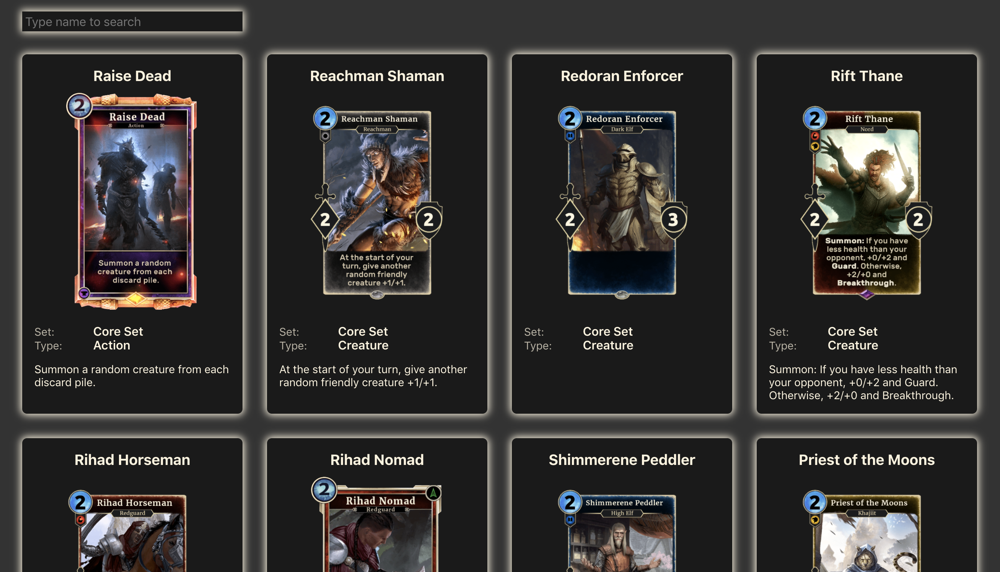
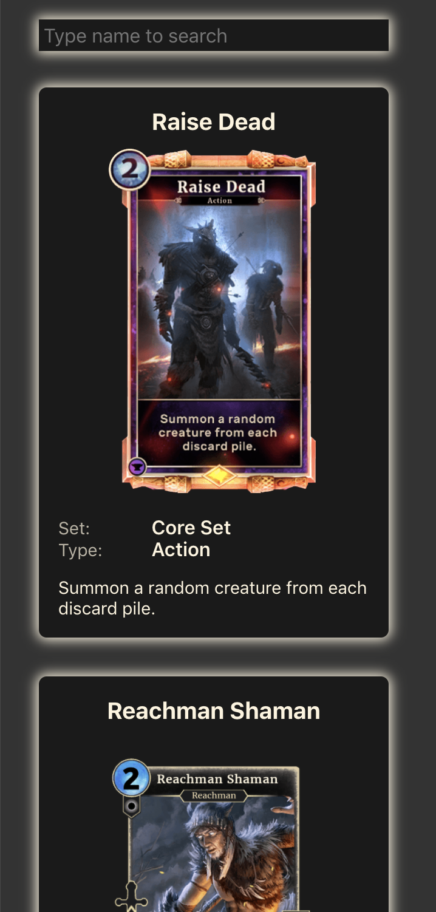

# Legends Card Browser
Find your favorite cards with this handy tool.

## Screens

Desktop

Mobile

## Running
You will need `node` and `yarn` to run locally.

`yarn start`
Runs the app in the development mode.

Open [http://localhost:3000](http://localhost:3000) to view it in the browser.

## Building

`yarn build`

Builds the app for production to the `build` folder.

It correctly bundles React in production mode and optimizes the build for the best performance.

The build is minified and the filenames include the hashes.

Your app is ready to be deployed!

See the section about [deployment](https://facebook.github.io/create-react-app/docs/deployment) for more information.
